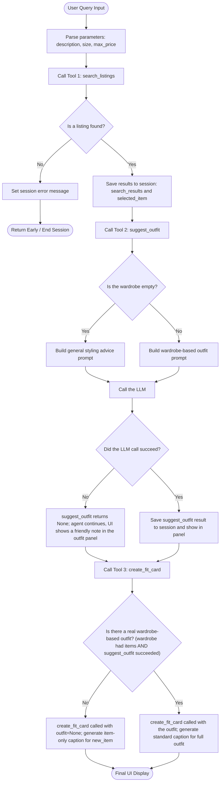

# FitFindr — planning.md

> Complete this document before writing any implementation code.
> Your spec and agent diagram are what you'll use to direct AI tools (Claude, Copilot, etc.) to generate your implementation — the more specific they are, the more useful the generated code will be.
> Your planning.md will be reviewed as part of your submission.
> Update it before starting any stretch features.

---

## Tools

List every tool your agent will use. For each tool, fill in all four fields.
You must have at least 3 tools. The three required tools are listed — add any additional tools below them.

### Tool 1: search_listings

**What it does:**
<!-- Describe what this tool does in 1–2 sentences -->
This tool will take the parse query and gather three important things that will allow us to use the search tool and find the item that matches the users query. The parameters we will get from the query are descriptions, size, as well as max_price. With the output being the dictionary showcasing all the attributes of that item. Results are returned sorted by keyword relevance, best match first.

**Input parameters:**
<!-- List each parameter, its type, and what it represents -->
- `description` (str): Natural Language Model matches the description the user types in "vintage graphic tee". This will then be matched to the title, description, and style_tags.
- `size` (str): Size string to filter by (e.g., "M", "W30", "8"). Case-insensitive. Pass None to skip size filtering.
- `max_price` (float): Max price in dollars. Pass None to skip filter.

**What it returns:**

This is what the return output should be:

    id (str): unique identifier   
    title (str): short description of the item,
    description (str): a paragraph description ,
    category (str): category of items (e.g., tops, bottoms, outerwear, shoes, accessories),
    style_tags (list[str]): Keywords/Classifiers that help describe the item,
    size(str): size of the item,
    condition (str): general condition of the item,
    price (float): listing price of the item,
    colors (list[str]): list of key colors,
    brand (str): brand of the item,
    platform (str): marketplace/platform the item is being sold

**Example Query**

This is an example for a query such as "I'm looking for high-waisted vintage denim shorts size W27 under $30" 

**Output example**
    "id": "lst_016",
    "title": "High-Waisted Denim Shorts — Cutoff",
    "description": "DIY cutoff denim shorts from Levi's 501s. Raw hem, slightly frayed. High-waisted. Perfect summer length.",
    "category": "bottoms",
    "style_tags": ["vintage", "denim", "summer", "classic"],
    "size": "W27",
    "condition": "good",
    "price": 24.00,
    "colors": ["light blue", "blue"],
    "brand": "Levi's",
    "platform": "poshmark"

**What happens if it fails or returns nothing:**
<!-- What should the agent do if no listings match? -->
If this tool fails, the agent sets a session["error"] and outputs "No listings matched '<description>'. Try a different description or raising your budget." The agent will not call suggest_outfit since there is no listing that the tool can reference.

---

### Tool 2: suggest_outfit

**What it does:**
<!-- Describe what this tool does in 1–2 sentences -->

If tool one is succeful, listing should be selected giving us an item we can use to make an outfit suggestion. We take the listing item and the user's current wardrobe, and suggest one or more complete outfit combinations. 

**Input parameters:**
- `new_item` (dict): this represents the results from tool one. All the attributes of the listing we pulled from the users query.
- `wardrobe` (dict): A list of dicts with 'items' as the key. There are two dicts an example_wardrobe that has a complete list of dicts with different items. 

One item has the following attributes:
     id (str): unique identifier,
     name (str): Short item name description,
     category (str): catogory of items (e.g., tops, bottoms, outerwear, shoes, accessories),
     colors (list[str]): list of colors to describe item,
     style_tags (list[str]): list of keywords that describe the style of the item.
     notes (str or null): Optional extra description for the item.

**What it returns:**
The tool should return 1-2 sentences suggesting potential style combinations the user can create with their current wardrobe. It should refer to a specific piece(s) and state how such piece enhances/combines with their new item.

**What happens if it fails or returns nothing:**

If the wardrobe is empty, offer general styling advice for the item rather than raising an exception or returning an empty string. The tool still calls the LLM, but prompts it for general styling ideas (what kinds of pieces pair well, what vibe the item suits) instead of referencing specific wardrobe items. The returned advice string ends with the line "For more personalized suggestions, try filling up your wardrobe file." so the user knows how to get tailored results. If the LLM call itself raises an exception, the tool returns `None` so we can still make the fit card, and a message is shown to the user (e.g., "Couldn't generate a suggestion, please try again in a moment").

---

### Tool 3: create_fit_card

**What it does:**
create_fit_card(outfit, new_item)
This will generate a short paragraph caption that is sharable through different social medias based on the selected item as well as the possible combinations that can be created from their current wardrobe. This will also use a higher LLM temperature to generate something creative and random each time. 

With the results of both step 1 and step 2, we can generate a short, shareable description of a complete outfit — the kind of thing someone would caption an Instagram post with. Must produce something different each time for different inputs. The output of this fit card will be the name of the item price as well as the platform. And to control how random these fit cards are we will simply increase the LLM temperature to encourages more creative and varied responses.
**Input parameters:**
<!-- List each parameter, its type, and what it represents -->
- `outfit` (str): A short paragraph generated by the previous tool. 
- `new_item` (dict): This will be the dict containing the new item that they got. This will have 'title', 'price' and 'platform' of the piece.

**What it returns:**
<!-- Describe the return value -->
This will return a 1-3 sentence caption that will include multiple things:

- The description, pricing, and platform of the `new_item`
- Captures the vibe of the `new_item`.
- A short sentence of how this new item will pair well with their wardrobe (using the results from `suggest_outfit`)
- Make it sound casual and authentic.
- Make sure that it is random and unique.
**What happens if it fails or returns nothing:**
<!-- What should the agent do if the outfit data is incomplete? -->

If the outfit parameter is `None`, the tool does not raise an error. Instead, it adapts and generates a creative caption focused entirely on the `new_item`. The empty-wardrobe case (where `suggest_outfit` returned general styling advice instead of a real outfit) is treated the same way: the agent calls `create_fit_card` with `outfit=None`, so the tool produces an item-only caption and the general advice is not woven into the caption.

What it will include:

- The description, pricing, and platform of the `new_item`
- Casual authethic response that captures the vibe of the `new_item`
- Random, unique, and creative response

---

## Planning Loop

**How does your agent decide which tool to call next?**
<!-- Describe the logic your planning loop uses. What does it look at? What conditions change its behavior? How does it know when it's done? -->

We need the query from the user. We will get `description`, `size`, and `max_price` from the query and store those attributes in a dict. 

After `search_listings` runs, we check whether an listing was found or not. If there was no item found, set an error message in the session and return early = "No listings matched '<description>'. Try a different description or raising your budget." If a listing is found, we make the `new_item` = results[0] and proceed to `suggest_outfit`.

With the `new_item` we can move on to suggest an outfit paragraph based on the clothing inside the wardrobe file. If the wardrobe is empty, `suggest_outfit` offers general styling advice for the item (rather than returning an empty string), so the user still gets a useful suggestion and we can prompt them to add clothes for more tailored results. If the wardrobe file is not empty, then we simply select the item that would match the piece and create a 1-3 sentence description of the suggested outfit.

Finally we create a 1-3 sentence shareable `fit_card`. We only weave the outfit into the caption when it is a real wardrobe-based outfit (the wardrobe had items AND `suggest_outfit` succeeded). In two cases the agent instead calls `create_fit_card` with `outfit=None`, producing an item-only caption that just hypes the `new_item`: (1) the wardrobe was empty, so `suggest_outfit` only returned general styling advice — that advice is still shown in the Outfit Suggestion Panel but is NOT fed into the fit card; and (2) `suggest_outfit` returned `None` because the LLM call failed.

Order: 

1. Initialize session and Parse Query: The first thing that need to be done is create a `new_session` function that will be in charge of storing all the information gathered from the tools. Then we need to  extract `description (str)`, `size (str or NULL)`, `max_price (float or NULL)` from the query iteself. Parsing is done with lightweight regex in `_parse_query()` (no LLM, so it stays deterministic and easy to test): `max_price` comes from price cues like "under $30" or a bare "$30"; `size` comes from "size X" phrasing or a waist/multi-letter token (e.g. W27, XXS, XL); and `description` is the leftover query text with those size/price phrases stripped out so they don't pollute the keyword search.
2. Find listing: With the parse query we retrieve the listing that closely matches the users prompt and store it inside a `dict`.
3. Suggest outfit: We will use the `wardrobe` to find an item that would be a good fit/combination with the listing. 
4. Return fit card: Once we have a suggested outfit, we will return a sharable fit card.
5. Agent knows its done once the fit card session is complete. 

---

## State Management

**How does information from one tool get passed to the next?**
<!-- Describe how your agent stores and accesses state within a session. What data is tracked? How is it passed between tool calls? -->

The agent tracks data across the interaction using a single session dictionary (or state object) that is initialized when the user submits their query. This prevents the user from having to re-enter information at any point.

The session tracks the following specific keys (these match the dict initialized in `_new_session()` in `agent.py`):

- `session["query"]`: The original, unmodified user query string.

- `session["parsed"]`: The parsed `description`, `size`, and `max_price` returned by `_parse_query()`.

- `session["search_results"]`: The full list of matching listing dicts returned by `search_listings`.

- `session["selected_item"]`: The top result (`search_results[0]`) — the dict passed into `suggest_outfit` and `create_fit_card`.

- `session["wardrobe"]`: The wardrobe dict for this run.

- `session["outfit_suggestion"]`: Stores the string returned by suggest_outfit (or None if the LLM call fails).

- `session["fit_card"]`: The caption string returned by create_fit_card.

- `session["error"]`: Stores any fatal error messages that require the loop to terminate early (currently only the no-results case).

Flow of State:

Once `search_listings` executes successfully, the full list is saved to `session["search_results"]` and the top result to `session["selected_item"]`.

The agent reads `session["selected_item"]` and the external `wardrobe` file, passing both directly into `suggest_outfit` without prompting the user.

The resulting string from `suggest_outfit` is saved to `session["outfit_suggestion"]`.

Finally, the agent reads `session["outfit_suggestion"]` and `session["selected_item"]` and passes them into `create_fit_card`, storing the caption in `session["fit_card"]`. Note: only a real wardrobe-based outfit is passed as the `outfit` argument — for an empty wardrobe (general advice) or a `None` from `suggest_outfit`, the agent passes `outfit=None` so the fit card is item-only.

---

## Error Handling

For each tool, describe the specific failure mode you're handling and what the agent does in response.

| Tool | Failure mode | Agent response |
|------|-------------|----------------|
| search_listings | No results match the query returns `[]` | Session error will rise and return early so no other tools are called. We will prompt the user with: "No listings matched '<description>'. Try a different description or raising your budget." |
| suggest_outfit | Wardrobe is empty, or LLM call raises an exception| If the wardrobe is empty, `suggest_outfit` offers general styling advice for the item rather than returning an empty string, and we prompt the user to "Try adding more items into wardrobe file for more tailored suggestions" then move on to `create_fit_card`. If an LLM call exception is raised, `suggest_outfit` returns `None` and the agent CONTINUES (this is not a fatal `session["error"]`, which is reserved for the no-results case that ends the loop early). `session["outfit_suggestion"]` stays `None`, and `handle_query` surfaces a friendly note in the Outfit panel: "Couldn't generate an outfit suggestion right now — please try again in a moment." The fit card is still produced (item-only, since `outfit=None` is passed). |
| create_fit_card | Outfit input is missing or incomplete | since `suggest_outfit` is returns `None` we will default andsimply create a short caption for the `new_item` using the `description`, `style_tags`, `price`, and `platform` to create a caption that captures the 'vibe' of the item |

---

## Architecture

<!-- Draw a diagram of your agent showing how the components connect:
     User input → Planning Loop → Tools (search_listings, suggest_outfit, create_fit_card)
                                                                          ↕
                                                                   State / Session
     Show what triggers each tool, how state flows between them, and where error paths branch off.
     ASCII art, a Mermaid diagram (https://mermaid.js.org/syntax/flowchart.html), or an embedded
     sketch are all fine. You'll share this diagram with an AI tool when asking it to implement
     the planning loop and each individual tool. -->

---

## AI Tool Plan

<!-- For each part of the implementation below, describe:
     - Which AI tool you plan to use (Claude, Copilot, ChatGPT, etc.)
     - What you'll give it as input (which sections of this planning.md, your agent diagram)
     - What you expect it to produce
     - How you'll verify the output matches your spec before moving on

     "I'll use AI to help me code" is not a plan.
     "I'll give Claude my Tool 1 spec (inputs, return value, failure mode) and ask it to implement
     search_listings() using load_listings() from the data loader — then test it against 3 queries
     before trusting it" is a plan. -->

**Milestone 3 — Individual tool implementations:**
For this Milestone I will be using Claude Code. Since this is where the tools will be built I will give it this file (`planning.md`) for Claude to have context of the overall project.

How I will use Claude for each tool:
Tool 1: `search_listings`

**AI Tool & Input**: I will use Claude Code. I will provide the function stub from `tools.py` and the exact Tool 1 spec from this document. I will explicitly instruct it to use `load_listings()` from `utils/data_loader.py` and not rewrite file loading logic.

**Expected Output**: A completed Python function that filters listings by description, size, and max price.

**Verification**: I will run pytest `tests/test_tools.py` using tests that check for a valid search, an empty list return for unmatched items, and strict enforcement of the max_price filter.

Tool 2: `suggest_outfit`

**AI Tool & Input**: I will feed the AI the Tool 2 spec, as well as the wardrobe schema structure from `data/wardrobe_schema.json`. I will be noting that it must use Groq's `llama-3.3-70b-versatile` model. I will explicitly prompt it: "If wardrobe['items'] is empty, offer general styling advice for the item rather than raising an exception or returning an empty string."

**Expected Output**: An LLM-powered function that safely handles empty wardrobes without crashing allowing for the use of tool 3 `create_fit_card`.

**Verification**: Write a pytest test passing an empty wardrobe dictionary and assert that it returns a non-empty styling-advice string (not an empty string and without raising). I'll test with both get_example_wardrobe() and get_empty_wardrobe().

Tool 3: create_fit_card

**AI Tool & Input**: I will provide the AI with the Tool 3 spec and function signature. I will instruct it to check if the outfit argument is missing or empty first, returning a caption fallback string that uses the LLM but only to describe the `new_item`. If not then simply use the `suggest_outfit` output as well as the dict from `new_item` to generate a creative caption 1-3 sentences. I will also tell it to set a higher temperature (e.g., 0.7 or 0.8) for creativity.

**Expected Output**: A creative caption generator with built-in validation.

**Verification**: Run a test with an empty outfit string to verify the fallback text triggers, and run identical happy-path tests back-to-back to ensure the outputs vary.

**Milestone 4 — Planning loop and state management:**

For this Milestone, I will continue using Claude Code to assemble the components built in Milestone 3 into a cohesive loop inside `agent.py` and connect it to the Gradio frontend in `app.py`.

How I will use Claude for the planning loop and integration:

**Task 1: Implement `run_agent()` in `agent.py`**

**AI Tool & Input**: I will use Claude Code. I will provide the `agent.py` file with its TODO stubs, alongside the Architecture Decision Tree and the State Management section from this `planning.md` document. I will also provide the completed `tools.py` file for context. I will explicitly instruct it: "Implement the `run_agent()` loop based strictly on this decision tree. Ensure state is passed via the session dictionary and do not prompt the user for input mid-loop."

**Expected Output**: A completed `run_agent()` function that initializes the session dictionary, parses the query, and executes the tools conditionally based on the results of `search_listings`.

**Review & Verification**: Before running the code, I will manually review the generated logic to ensure it does not call `suggest_outfit` unconditionally. I will specifically check the branch where `search_listings` returns empty to verify it sets `session["error"]` and returns early. If Claude hallucinates extra state variables or tries to run tools out of order, I will manually override the code to enforce my defined session keys (selected_item, outfit_suggestion, error).

**Task 2: Implement `handle_query()` in `app.py`**

**AI Tool & Input**: I will use Claude Code. I will provide the `app.py` stub and instruct it to complete the `handle_query()` function. I will tell it: "Call `run_agent()` with the user query, and map the resulting session dictionary directly to the three Gradio output strings as defined in the TODOs."

**Expected Output**: A function that unpacks the final session state and routes the strings/dictionaries to the correct UI display panels.

**Review & Verification**: I will review the generated code to guarantee that no hardcoded fallback values are being injected into the UI at this stage. I will verify that `session["selected_item"]` maps to the search panel, `session["outfit_suggestion"]` maps to the styling panel, and `session["fit_card"]` maps to the social media panel. Finally, I will test the integration by printing `session["selected_item"]` to the terminal during a run to confirm the exact dict is passing seamlessly without re-entry.

---

## A Complete Interaction (Step by Step)

Write out what a full user interaction looks like from start to finish — tool call by tool call. Use a specific example query.

**Example user query:** "I'm looking for a vintage graphic tee under $30. I mostly wear baggy jeans and chunky sneakers. What's out there and how would I style it?"

**Step 1:**
Query Parsing + search_listing(description, size, max_price)

Firstly, we need to turn the user natural language query into structured components that can be understood and processed by a system, allowing for effective information retrieval and response generation. We need to extract the description=[vintage graphic tee], size="none", price=30.

After having the query parsing, now we can start searching for the item the user might be interested in with a search_listing function -> search_listing(description=str, size=str,price=float), we can return a relevance-sorted list where the top item is the `session["selected_item"]` item.

If the list is empty, the session will return an error stating "No listings matched 'vintage graphic tee'. Try a different description or raising your budget." 

**Step 2:**
suggest_outfit(new_item, wardrobe)

If we have a successful listing search that means that we have the item we are looking for. Given that specific item and the user's current wardrobe, we can use the `suggest_outfit(new_item, wardrobe)` to suggests one or more complete outfit combinations. 

If the wardrobe is empty, `suggest_outfit` returns general styling advice for the item (rather than `None`) so the user still gets a useful suggestion and a fit card. The advice string ends with the line "For more personalized suggestions, try filling up your wardrobe file." so the user knows how to get tailored results. We route this advice to the Outfit Suggestion Panel in Gradio. Note: because this is general advice and not a real wardrobe-based outfit, it is NOT woven into the fit card — see Step 3, where `create_fit_card` is called with `outfit=None` and produces an item-only caption.

**Step 3:**
create_fit_card(outfit, new_item)

With the results of both step 1 and step 2, we can generate a short, shareable description of a complete outfit — the kind of thing someone would caption an Instagram post with. Must produce something different each time for different inputs. The output of this fit card will be the name of the item price as well as the platform. And to control how random these fit cards are we will simply increase the LLM temperature to encourages more creative and varied responses.

The fit card only weaves in a real wardrobe-based outfit. If the wardrobe was empty (Step 2 only produced general styling advice) or `suggest_outfit` returned `None`, the agent calls `create_fit_card` with `outfit=None`, and the tool produces an item-only caption focused entirely on the `new_item`.

**Final output to user:**
<!-- What does the user actually see at the end? -->
The User will see all three steps displayed, the search item we matched their query to, the suggested outfits we recommend given their current wardrobe, as well as a fit card that they can share to other about the new item and the outfit ideas they have for it.

Search Panel: Have the complete attribute list of the search item. In this example it would look something like this

    "id": "lst_002",
    "title": "Y2K Baby Tee — Butterfly Print",
    "description": "Super cute early 2000s baby tee with butterfly graphic. Fitted crop length. Tag says medium but fits like a small.",
    "category": "tops",
    "style_tags": ["y2k", "vintage", "graphic tee", "cottagecore"],
    "size": "S/M",
    "condition": "excellent",
    "price": 18.00,
    "colors": ["white", "pink", "purple"],
    "brand": null,
    "platform": "depop"

Outfit Suggestion Panel: Include one outfit suggestion that will pair specific wardrobe items and how they match with the searched piece.

Fit Card: A informal creative card that will highlight the outfit by stating the description, price, and platform they acquired it from. The vibe of the item, as well as how the item fits well with their current wardrobe. This will be a simply 1-3 sentences for them to copy and paste it to any social media. 